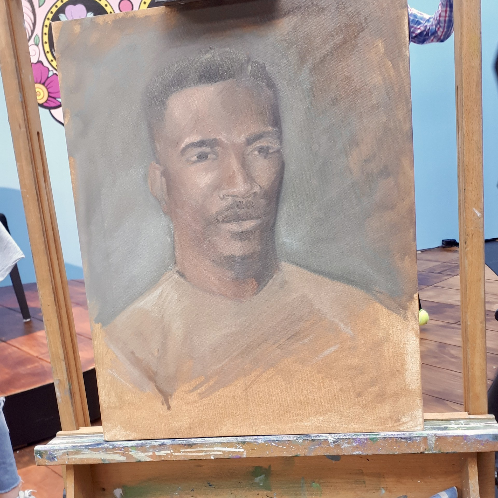
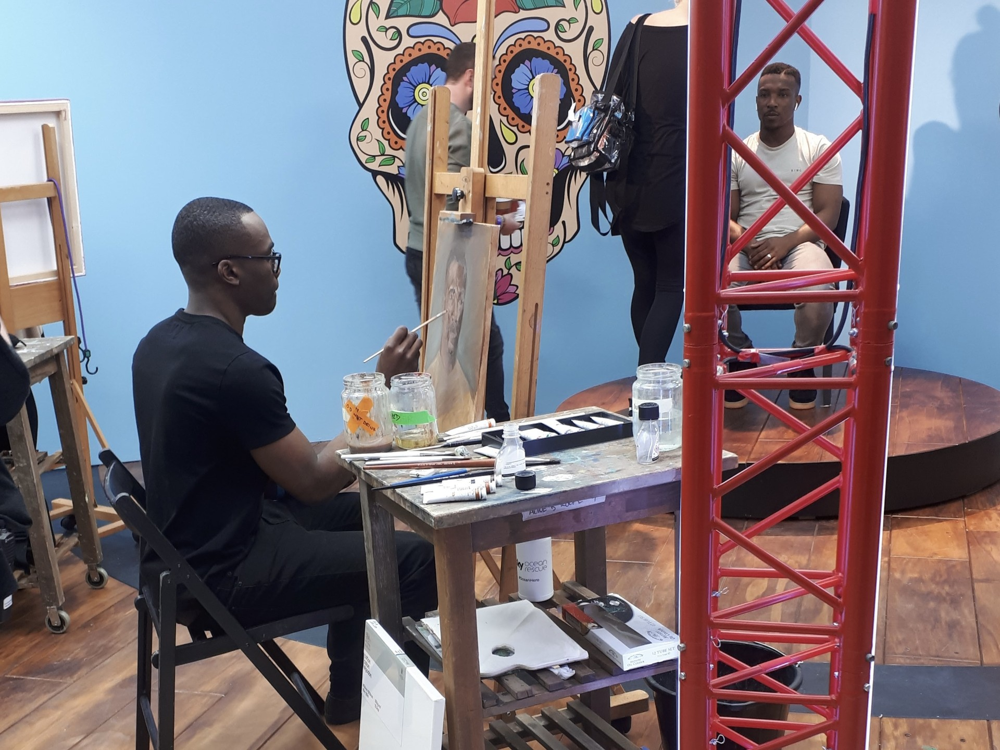
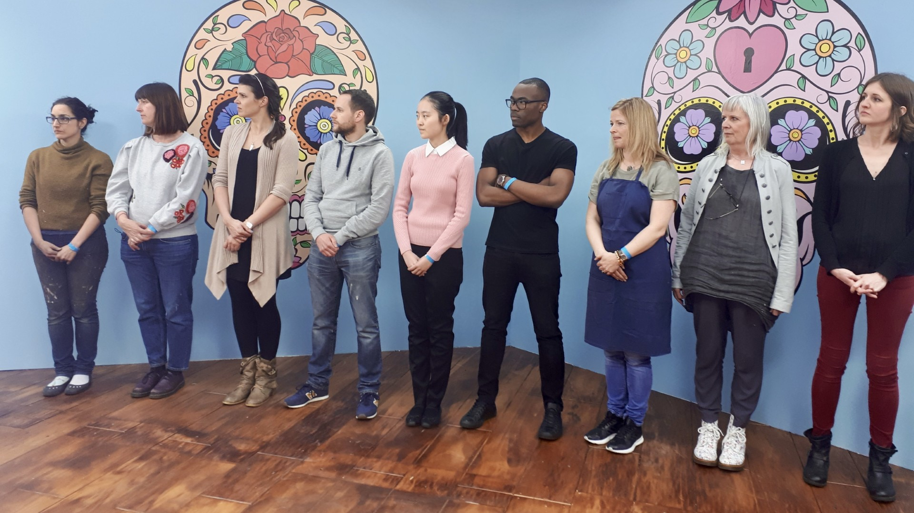

# Sky Arts Portrait Artist of the Year 2019 | National Contestant
Selected from thousands of applicants to compete in the nationally televised 2019 series of Sky Arts Portrait Artist of the Year.

  
   
  <i>Oil on Canvas - Competed on Sky Arts Portrait Artist of the Year (2019)</i>

**The Challenge:** Produced a high-fidelity oil portrait of actor Ashley Walters (Top Boy) within a strictly timed, four-hour live-audience environment.

  
   
  <i>Painting on set</i>

**Key Skills:**  Demonstrated extreme focus, rapid anatomical observation, and the ability to execute complex technical work under intense media scrutiny and time constraints.

  
   
  <i>Heat 2 Contestants</i>

## 📰 Press & Media Coverage
*   **Official Feature:** [Sky Arts Portrait Artist of the Year - Series 5, Heat 2](https://artistoftheyear.co.uk/contest/portrait-artist-of-the-year-2019/)
*   **Feature Article:** [Artist Boris paints celebrities’ portraits in top TV contest](https://www.eadt.co.uk/things-to-do/21444547.artist-boris-paints-celebrities-portraits-top-tv-contest/?ref=cprfa)
